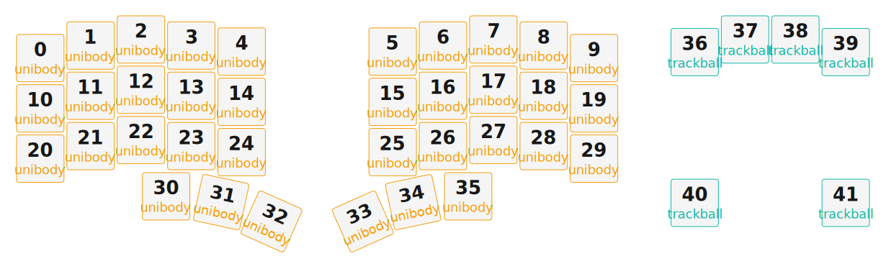

# ZMK Configuration for pteronTB

*Generated by Shield Wizard for ZMK*



Download compiled firmware from the Actions tab. <https://zmk.dev/docs/user-setup#installing-the-firmware>

Edit your keymap <https://zmk.dev/docs/keymaps>.
User keymap is located at [`config/pterontb.keymap`](config/pterontb.keymap).

-----

<details>
<summary>
Shield Wizard Debug Information
</summary>

In case of broken configuration, here is the Shield Wizard internal data used to generate this configuration:

Commit: 5840d41ac0915092c8fe45da617ffb4bb91e1b97

```json
{"name":"pteronTB","shield":"pterontb","dongle":true,"modules":["badjeff/pmw3610"],"layout":[{"id":"01KN9S43HQ3PCKSBZSHAYQDMK1","part":0,"row":0,"col":0,"w":1,"h":1,"x":0,"y":0.37,"r":0,"rx":0,"ry":0},{"id":"01KN9S43HQ7G0BA05VVZQ7HGTH","part":0,"row":0,"col":1,"w":1,"h":1,"x":1,"y":0.12,"r":0,"rx":0,"ry":0},{"id":"01KN9S43HQRZS2YR3D79R9A4XD","part":0,"row":0,"col":2,"w":1,"h":1,"x":2,"y":0,"r":0,"rx":0,"ry":0},{"id":"01KN9S43HQKZCZJ8ZKS45W55NZ","part":0,"row":0,"col":3,"w":1,"h":1,"x":3,"y":0.12,"r":0,"rx":0,"ry":0},{"id":"01KN9S43HQ4FE59SK88GW4W1JC","part":0,"row":0,"col":4,"w":1,"h":1,"x":4,"y":0.24,"r":0,"rx":0,"ry":0},{"id":"01KN9S43HQ2Y5HSWKMZPE6BYK1","part":0,"row":0,"col":5,"w":1,"h":1,"x":7,"y":0.24,"r":0,"rx":0,"ry":0},{"id":"01KN9S43HQKYCB9BN3FME8X79H","part":0,"row":0,"col":6,"w":1,"h":1,"x":8,"y":0.12,"r":0,"rx":0,"ry":0},{"id":"01KN9S43HQMNK196K26PH0G8HK","part":0,"row":0,"col":7,"w":1,"h":1,"x":9,"y":0,"r":0,"rx":0,"ry":0},{"id":"01KN9S43HQWZ1JCRNBHWPG3XXE","part":0,"row":0,"col":8,"w":1,"h":1,"x":10,"y":0.12,"r":0,"rx":0,"ry":0},{"id":"01KN9S43HQ7FNE2QFBMYY1CQFQ","part":0,"row":0,"col":9,"w":1,"h":1,"x":11,"y":0.37,"r":0,"rx":0,"ry":0},{"id":"01KN9S43HQQHWXTTN3V3G7Y9XT","part":0,"row":1,"col":0,"w":1,"h":1,"x":0,"y":1.37,"r":0,"rx":0,"ry":0},{"id":"01KN9S43HQVJ8WZ4MQ875CASHY","part":0,"row":1,"col":1,"w":1,"h":1,"x":1,"y":1.12,"r":0,"rx":0,"ry":0},{"id":"01KN9S43HQVNXD37X0RBHE4XQ1","part":0,"row":1,"col":2,"w":1,"h":1,"x":2,"y":1,"r":0,"rx":0,"ry":0},{"id":"01KN9S43HQX8FRME5JBX29NKCQ","part":0,"row":1,"col":3,"w":1,"h":1,"x":3,"y":1.12,"r":0,"rx":0,"ry":0},{"id":"01KN9S43HQ6VECW5Y18DB247A0","part":0,"row":1,"col":4,"w":1,"h":1,"x":4,"y":1.24,"r":0,"rx":0,"ry":0},{"id":"01KN9S43HQH8BEKHKYFSGSA11G","part":0,"row":1,"col":5,"w":1,"h":1,"x":7,"y":1.24,"r":0,"rx":0,"ry":0},{"id":"01KN9S43HQABV8DY3NPVC8MMHE","part":0,"row":1,"col":6,"w":1,"h":1,"x":8,"y":1.12,"r":0,"rx":0,"ry":0},{"id":"01KN9S43HQ5GDKHN85E92BA62X","part":0,"row":1,"col":7,"w":1,"h":1,"x":9,"y":1,"r":0,"rx":0,"ry":0},{"id":"01KN9S43HQRQ4ZFCB3XQN7CRDN","part":0,"row":1,"col":8,"w":1,"h":1,"x":10,"y":1.12,"r":0,"rx":0,"ry":0},{"id":"01KN9S43HQVS99HGAXXYQRKETS","part":0,"row":1,"col":9,"w":1,"h":1,"x":11,"y":1.37,"r":0,"rx":0,"ry":0},{"id":"01KN9S43HQW0V6Q57E2ZQ79A0J","part":0,"row":2,"col":0,"w":1,"h":1,"x":0,"y":2.37,"r":0,"rx":0,"ry":0},{"id":"01KN9S43HQ7A3E7ZE3M1P12F4Q","part":0,"row":2,"col":1,"w":1,"h":1,"x":1,"y":2.12,"r":0,"rx":0,"ry":0},{"id":"01KN9S43HQ5YKXE9FQB9714FVV","part":0,"row":2,"col":2,"w":1,"h":1,"x":2,"y":2,"r":0,"rx":0,"ry":0},{"id":"01KN9S43HQY71K9EM30RCTZY6W","part":0,"row":2,"col":3,"w":1,"h":1,"x":3,"y":2.12,"r":0,"rx":0,"ry":0},{"id":"01KN9S43HQVKVDVGW54A75ECZ2","part":0,"row":2,"col":4,"w":1,"h":1,"x":4,"y":2.24,"r":0,"rx":0,"ry":0},{"id":"01KN9S43HQRPJQV8735C5C8SF4","part":0,"row":2,"col":5,"w":1,"h":1,"x":7,"y":2.24,"r":0,"rx":0,"ry":0},{"id":"01KN9S43HQBVKAS6QVCWDPPMSE","part":0,"row":2,"col":6,"w":1,"h":1,"x":8,"y":2.12,"r":0,"rx":0,"ry":0},{"id":"01KN9S43HQJ25JD222N9X76WEF","part":0,"row":2,"col":7,"w":1,"h":1,"x":9,"y":2,"r":0,"rx":0,"ry":0},{"id":"01KN9S43HQ2CTFN96C9RP39EVV","part":0,"row":2,"col":8,"w":1,"h":1,"x":10,"y":2.12,"r":0,"rx":0,"ry":0},{"id":"01KN9S43HQ8FWCNT1ATRWPN1YR","part":0,"row":2,"col":9,"w":1,"h":1,"x":11,"y":2.37,"r":0,"rx":0,"ry":0},{"id":"01KN9S43HQGFQG1BN4D766C71A","part":0,"row":3,"col":2,"w":1,"h":1,"x":2.5,"y":3.12,"r":0,"rx":0,"ry":0},{"id":"01KN9S43HQCKEY241P4640B75R","part":0,"row":3,"col":3,"w":1,"h":1,"x":3.5,"y":3.12,"r":12,"rx":3.5,"ry":4.12},{"id":"01KN9S43HQXF78425ZM38BXKG5","part":0,"row":3,"col":4,"w":1,"h":1,"x":4.23,"y":3.33,"r":24,"rx":4.23,"ry":4.83},{"id":"01KN9S43HQ75WM0C93PXYNNDHJ","part":0,"row":3,"col":5,"w":1,"h":1,"x":6.77,"y":3.33,"r":-24,"rx":7.77,"ry":4.83},{"id":"01KN9S43HQQSTR0NNPE4J6YY0B","part":0,"row":3,"col":6,"w":1,"h":1,"x":7.5,"y":3.12,"r":-12,"rx":8.5,"ry":4.12},{"id":"01KN9S43HQ6A24DW3B7HMYMH34","part":0,"row":3,"col":7,"w":1,"h":1,"x":8.5,"y":3.12,"r":0,"rx":0,"ry":0},{"id":"01KN9SEHPJZA72CEKPNSX1S6JM","part":1,"row":4,"col":0,"w":1,"h":1,"x":13,"y":0.25,"r":0,"rx":0,"ry":0},{"id":"01KN9SF00C79M9XMCXA0SA8BDD","part":1,"row":4,"col":1,"w":1,"h":1,"x":14,"y":0,"r":0,"rx":0,"ry":0},{"id":"01KN9SF138DAM91RNBJG594YVM","part":1,"row":4,"col":2,"w":1,"h":1,"x":15,"y":0,"r":0,"rx":0,"ry":0},{"id":"01KN9SF287EQYAWEMV6W7DZJQH","part":1,"row":4,"col":3,"w":1,"h":1,"x":16,"y":0.25,"r":0,"rx":0,"ry":0},{"id":"01KN9SF6FV35GQMDZ5QQTP04XS","part":1,"row":4,"col":4,"w":1,"h":1,"x":13,"y":3.25,"r":0,"rx":0,"ry":0},{"id":"01KN9SF6NR1QQY689WSFFK1BNM","part":1,"row":4,"col":5,"w":1,"h":1,"x":16,"y":3.25,"r":0,"rx":0,"ry":0}],"parts":[{"name":"unibody","controller":"nice_nano_v2","wiring":"matrix_diode","pins":{"d21":"output","d20":"output","d19":"output","d4":"output","d5":"input","d18":"input","d15":"input","d6":"input","d7":"input","d14":"input","d16":"input","d8":"input","d9":"input","d10":"input"},"keys":{"01KN9S43HQ3PCKSBZSHAYQDMK1":{"input":"d10","output":"d21"},"01KN9S43HQQHWXTTN3V3G7Y9XT":{"input":"d10","output":"d20"},"01KN9S43HQW0V6Q57E2ZQ79A0J":{"input":"d10","output":"d19"},"01KN9S43HQ7G0BA05VVZQ7HGTH":{"input":"d16","output":"d21"},"01KN9S43HQVJ8WZ4MQ875CASHY":{"input":"d16","output":"d20"},"01KN9S43HQ7A3E7ZE3M1P12F4Q":{"input":"d16","output":"d19"},"01KN9S43HQRZS2YR3D79R9A4XD":{"input":"d14","output":"d21"},"01KN9S43HQVNXD37X0RBHE4XQ1":{"input":"d14","output":"d20"},"01KN9S43HQ5YKXE9FQB9714FVV":{"input":"d14","output":"d19"},"01KN9S43HQXF78425ZM38BXKG5":{"input":"d14","output":"d4"},"01KN9S43HQKZCZJ8ZKS45W55NZ":{"input":"d15","output":"d21"},"01KN9S43HQX8FRME5JBX29NKCQ":{"input":"d15","output":"d20"},"01KN9S43HQY71K9EM30RCTZY6W":{"input":"d15","output":"d19"},"01KN9S43HQCKEY241P4640B75R":{"input":"d15","output":"d4"},"01KN9S43HQ4FE59SK88GW4W1JC":{"input":"d18","output":"d21"},"01KN9S43HQ6VECW5Y18DB247A0":{"input":"d18","output":"d20"},"01KN9S43HQVKVDVGW54A75ECZ2":{"input":"d18","output":"d19"},"01KN9S43HQGFQG1BN4D766C71A":{"input":"d18","output":"d4"},"01KN9S43HQ2Y5HSWKMZPE6BYK1":{"input":"d5","output":"d21"},"01KN9S43HQH8BEKHKYFSGSA11G":{"input":"d5","output":"d20"},"01KN9S43HQRPJQV8735C5C8SF4":{"input":"d5","output":"d19"},"01KN9S43HQ6A24DW3B7HMYMH34":{"input":"d5","output":"d4"},"01KN9S43HQKYCB9BN3FME8X79H":{"input":"d6","output":"d21"},"01KN9S43HQABV8DY3NPVC8MMHE":{"input":"d6","output":"d20"},"01KN9S43HQBVKAS6QVCWDPPMSE":{"input":"d6","output":"d19"},"01KN9S43HQQSTR0NNPE4J6YY0B":{"input":"d6","output":"d4"},"01KN9S43HQMNK196K26PH0G8HK":{"input":"d7","output":"d21"},"01KN9S43HQ5GDKHN85E92BA62X":{"input":"d7","output":"d20"},"01KN9S43HQJ25JD222N9X76WEF":{"input":"d7","output":"d19"},"01KN9S43HQ75WM0C93PXYNNDHJ":{"input":"d7","output":"d4"},"01KN9S43HQWZ1JCRNBHWPG3XXE":{"input":"d8","output":"d21"},"01KN9S43HQRQ4ZFCB3XQN7CRDN":{"input":"d8","output":"d20"},"01KN9S43HQ2CTFN96C9RP39EVV":{"input":"d8","output":"d19"},"01KN9S43HQ7FNE2QFBMYY1CQFQ":{"input":"d9","output":"d21"},"01KN9S43HQVS99HGAXXYQRKETS":{"input":"d9","output":"d20"},"01KN9S43HQ8FWCNT1ATRWPN1YR":{"input":"d9","output":"d19"}},"encoders":[],"buses":[{"name":"spi0","devices":[],"type":"spi"},{"name":"spi1","devices":[],"type":"spi"},{"name":"spi2","devices":[],"type":"spi"},{"name":"spi3","devices":[],"type":"spi"},{"name":"i2c0","devices":[],"type":"i2c"},{"name":"i2c1","devices":[],"type":"i2c"}]},{"name":"trackball","controller":"xiao_ble","wiring":"direct_gnd","pins":{"d1":"input","d2":"input","d3":"input","d4":"input","d5":"input","d6":"input","d8":"bus","d9":"bus","d7":"bus","d10":"bus"},"keys":{"01KN9SEHPJZA72CEKPNSX1S6JM":{"input":"d1"},"01KN9SF00C79M9XMCXA0SA8BDD":{"input":"d2"},"01KN9SF138DAM91RNBJG594YVM":{"input":"d3"},"01KN9SF287EQYAWEMV6W7DZJQH":{"input":"d4"},"01KN9SF6FV35GQMDZ5QQTP04XS":{"input":"d5"},"01KN9SF6NR1QQY689WSFFK1BNM":{"input":"d6"}},"encoders":[],"buses":[{"name":"spi0","devices":[{"type":"pmw3610","cs":"d7","irq":"d10","cpi":800,"swapxy":true,"invertx":true,"inverty":true}],"type":"spi","mosi":"d9","miso":"d9","sck":"d8"},{"name":"spi1","devices":[],"type":"spi"},{"name":"spi2","devices":[],"type":"spi"},{"name":"spi3","devices":[],"type":"spi"},{"name":"i2c0","devices":[],"type":"i2c"},{"name":"i2c1","devices":[],"type":"i2c"}]}]}
```

</details>
